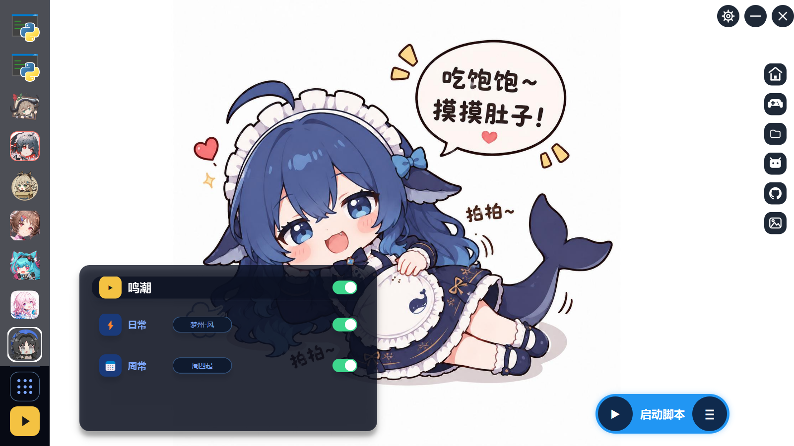

# OneDragon-Helper

本项目是多游戏自动化脚本调度器，支持多个游戏的脚本调度。

大肥鲸不擅长GUI，等下一款擅长GUI的廉价模型再优化GUI。

## 功能

- 集成多游戏脚本，形成脚本链一同运行
- 更改各脚本日常和周常配置
- 非阻塞运行脚本
- 日志解析与重新运行

## install

`uv sync`

## activate on cmd

`.venv\Scripts\activate.bat`

## run

`python -m src.launcher`
