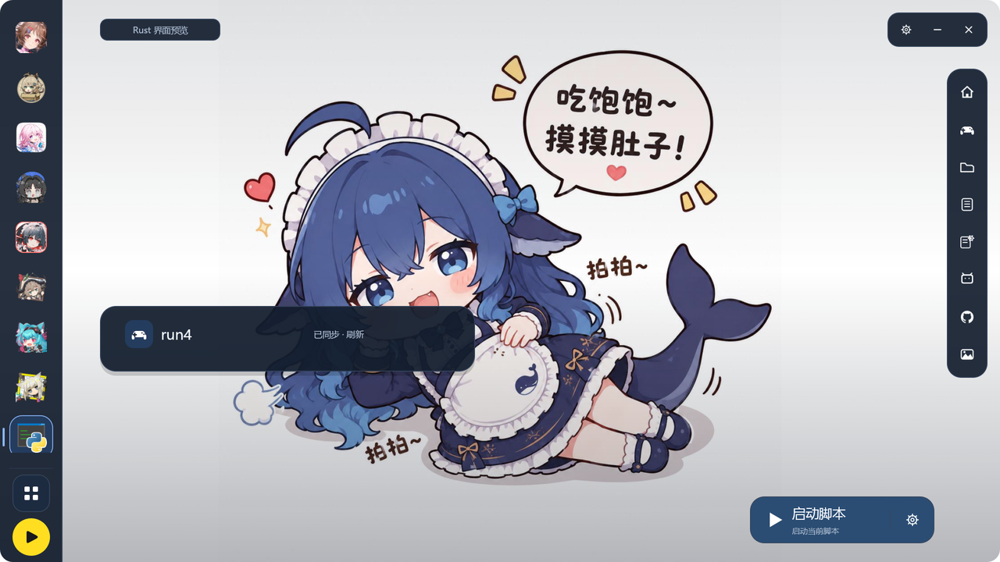

# OneDragon-Helper
[本项目](https://github.com/WinSa/OneDragon-Helper)是多游戏自动化脚本调度器。


## 功能简介

- 更改各脚本日常和周常配置
  - 首先点击右下角的 ☰ 键进行配置，选择正确的脚本路径。随后即可更改日常和周常副本
- 集成多游戏脚本，形成脚本链一同运行
  - 点击左下角的【启动全部】即可
- 非阻塞运行脚本
- 日志解析与重新运行
- 动态背景
  - 点击右侧壁纸图标即可配置
- 更多功能欢迎提交Pull Request

## 开发者指南

同一仓库按四个子项目组织：

```text
rust-gui/          # Rust 前端：src/、tests/、Cargo.toml
runner/            # 脚本运行器，保留现有 submodule
python-backend/    # Python 业务与 CLI：src/、tests/、pyproject.toml
python-gui/        # Python 前端：src/gui、tests/、pyproject.toml
config/           # 共享声明、配置模板与本地用户配置
assets/           # 共享图片、图标
tools/、deploy/   # 跨项目构建、打包、发布工具
```

根目录 `pyproject.toml` 管理 uv workspace 和 Ruff，`uv.lock` 锁定共享 Python 环境。

在仓库根目录安装依赖：`uv sync --frozen`。

- Rust GUI：`launcher-rust.bat`。
- Python GUI：`launcher.bat`，或 `uv run python -m gui.launcher`。

构建与测试见 [TESTING.md](TESTING.md)，Rust 说明见 [rust-gui/README.md](rust-gui/README.md)。
