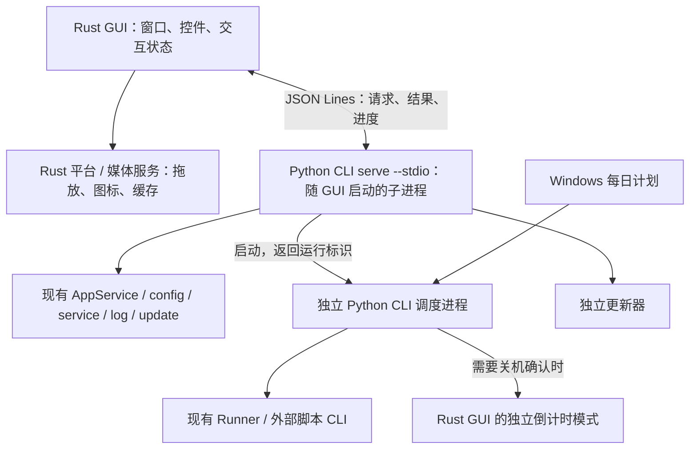

# Rust GUI / Python CLI 边界设计

基线：`main@71bc7c5`。阶段选择：**先保留助手业务为 Python CLI，逐步迁移**。
本文是调用审计与设计草案，命令和消息名称均为拟议接口，尚未实现。

## 结论

当前 GUI 并非 CLI 的壳：它在进程内调用 AppService，还直接访问部分 config/utils。
但大多数调用只涉及普通数据、文件或进程，并不必须与 GUI 同进程。
可以保留 Python 配置适配、调度、日志分析、备份和更新业务，给它们增加进程接口。
需要在 Rust 界面侧重做的主要是控件/状态绑定、弹窗、媒体、图标和原生窗口交互。

已有 `src.cli` 可以直接导入而不加载 Qt；问题在于当前实际入口仍走
`src.launcher`，以及关机等业务末端仍能回调 PySide6。
本次独立进程验证：导入 `src.cli` 后没有 PySide6/Shiboken 模块；导入
`src.launcher` 后有 25 个相关模块。这是导入边界验证，不代表全部运行路径已经无 Qt。

## 现有调用清单

“已有 CLI”仅指代码中确有入口，不代表该入口已适合作为机器通信协议。

| GUI 功能 | 当前非 CLI 调用 | 已有 CLI 覆盖 | 建议拆分 |
| --- | --- | --- | --- |
| 左侧脚本列表，添加/删除/排序 | `game_list.py` → `load_config/build_script_entry/add_script/remove_script/save_config` | `--list-scripts` 只列标识；`--get-script/--dump-config` 提供部分读取；没有增删改排序接口 | 列表/变更归 Python；选中项、拖动预览和本次手动勾选归 Rust |
| 单脚本配置弹窗 | `dialogs.py` → `get_script/weekly_inputs/get_script_switches`；保存再调 `update_script/set_script_switches` | 只有脚本条目读取；没有完整编辑数据与保存入口 | Python 返回表单数据/允许值/业务校验；Rust 构建控件、收集输入和显示错误 |
| 日常任务卡、菜单、开关 | `task_card.py` → `get_daily_readback/is_adapted` 直接读 config；菜单及写入经 AppService | 无 | Python 返回物化选项和真实已选值；Rust 展示菜单并提交选择 |
| 周常副本、每条周常的周几起 | 直接调 `get_weekly_task`，其余经 `get_weekly_map/get_weekly_start_for/set_script_weekly_task/set_weekly_start_for` | `--check-weekly` 仅检查；`--weekly-start` 是生成链时的脚本级覆盖且只接受 1～7，不能覆盖 GUI 的条目级和 0=不启用语义 | 独立周常查询/选择/起始日接口；保留部分落盘后同步失败的提示 |
| 启动设置、运行选项、邮件授权码 | `backup.py/launch.py` → `load/apply_startup_options`、`load/apply_run_options` | 运行参数仅覆盖部分执行选项，没有设置表单的完整持久化接口 | Python 处理配置和凭据；Rust 管表单与确认窗 |
| 每日计划编辑、系统任务状态 | `daily_plan.py` → `load_daily_plan/apply_daily_plan/read_daily_task_state` | `--run-daily` 负责执行，没有完整读/写/状态接口 | COM/系统任务保留 Python；Rust 展示并保存；计划入口改指向无 GUI CLI |
| 启动全部 | GUI 校验/确认后 `spawn_schedule_run` | 已通过 `--schedule-run now` 起独立进程 | 保留独立运行生命周期；补结构化校验和启动结果 |
| 启动单脚本、启动游戏 | `launch.py` 直接构建 Runner 命令/Popen 或打开文件；`links.py` 读游戏路径后启动 | Python 单脚本已有 Runner `--script`；助手缺统一启动接口 | 路径/参数/启动策略归 service；GUI 发明确动作 |
| 打开主页、目录、日志、配置文件 | `links.py` 直接调用 `set_config/link/log/utils` 解析路径或链接 | 无 | Python 返回目标与不可用原因；Rust 本地平台服务调用系统浏览器/资源管理器 |
| 图片/视频壁纸 | `background.py` 读默认路径/壁纸映射；调用 QImage、QVideoSink；保存首帧经 AppService | 无 | Python 保留映射与脚本默认路径规则；媒体渲染、编码和预览缓存服务留 Rust |
| 配置备份/恢复 | `backup.py` → `create_backup/restore_backup` | 已有 `--backup-config/--restore-config` | Rust 选文件、显示结果；复用 Python 实现 |
| 检查/下载/安装更新 | `UpdateWorker` 用 QThread 调 AppService，传进度回调和 threading.Event | 独立安装器有 CLI；面向 GUI 的检查/下载/交接缺接口 | Python 业务产生事件；Rust 显示状态、发取消、协调退出 |
| 运行后关机 | `schedule/cli → utils_shutdown → gui.shutdown_dialog` | CLI 仍会拉起 PySide6 倒计时窗 | 改为显式调用 Rust 确认窗入口，结果返回给 Python 执行关机 |

主要入口：
[AppService](../../src/service/app_service.py)、[现有 CLI](../../src/cli.py)、
[任务卡](../../src/gui/controllers/task_card.py)、[脚本列表](../../src/gui/controllers/game_list.py)、
[运行](../../src/gui/controllers/launch.py)、[更新](../../src/gui/controllers/update.py)。

基线中的手动勾选实际是 `GameListController._enabled` 内存态，
`_set_enabled` 不写盘；每日计划独立。部分指南文字描述为持久化，与此提交代码不一致。
迁移此基线时先保留实际行为，不在通信层改动持久化语义。

## 必须留在界面侧的能力

| 能力 | 当前实现 | 边界 |
| --- | --- | --- |
| 主窗口、菜单、动画、选中与表单草稿 | QML、QObject 属性/信号、QAbstractListModel、Widgets 弹窗 | Rust UI 状态；不要把每次属性求值变成 CLI 调用 |
| 移动、最小化、关闭 | `controllers/window.py` | 直接操作当前窗口 |
| 外部文件拖入 | `file_drop.py` 的窗口句柄、WM_DROPFILES 与原生事件过滤 | Rust 捕获路径列表；Python 做快捷方式解析、去重、条目构造及保存 |
| 图标提取/绘制 | `icons.py` 的 QIcon/QPixmap/QPainter/QQuickImageProvider、Windows 图标查询 | Rust 绘制/缓存；Python 只提供脚本/游戏 EXE 路径 |
| 视频播放、首帧、图像缩放 | `background.py`、`qml/background.qml` 的 QVideoSink/QImage/MediaPlayer | Rust 媒体层；Qt 对象、窗口句柄和逐帧数据不进入 JSON 协议 |
| 文件选择、确认、倒计时、提示 | `dialogs.py` 等 Widgets 弹窗 | Rust 负责交互；业务只接受确认后的数据或明确确认结果 |

保留 QML 可以复用主场景，但现有 Widgets 弹窗及 Python QObject 控制器不会自动复用。
不能为了暂时保留这些弹窗又在 Python 后端打入 PySide6，否则 Qt 解耦目标没有完成。

现有 `_build_wallpaper_cache` 在 GUI 控制器内执行 `os.remove/os.makedirs/QImage.save`，
这是“GUI 不写盘”的现存缺口。设计上把图片编码与持久化拆开：GUI/渲染层产出图像，
Rust 的无 GUI 依赖 MediaCacheService 负责缓存命名、失效及原子写入；
Python 继续负责壁纸选择映射和各脚本的默认资源路径。两边不得各自重写同一份配置。

## 建议的进程结构



Python CLI 同时支持两种用法：

- **一次性命令**：供人工、测试、每日计划和独立运行使用。
- **`serve --stdio`**：GUI 启动一个后台子进程，复用解释器、AppService 和配置缓存；
  不是开机常驻服务，不需要监听网络端口。GUI 退出时关闭它，独立运行进程继续存活。

只替换传输方式，不把现有每个 Python 函数逐一映射成远程方法。
例如打开配置窗一次取完整表单；选中脚本一次取任务卡和资源元数据；
避免一项周常产生“读名称→读选项→读选中项→读起始日”四次往返。

### 业务接口按用户动作组织

| 拟议接口组 | 内容 |
| --- | --- |
| `app.snapshot` | 脚本列表、启动选项、每日计划摘要；不启动全部脚本的深度扫描 |
| `script.view` | 指定脚本的日常/周常状态、物化菜单、能力标记、游戏/配置/日志/背景资源路径 |
| `script.edit_data` / `script.update` | 完整编辑表单；一次提交条目、七日超时、原生任务开关；结果说明哪些修改成功 |
| `script.add/remove/reorder` | 路径导入、删除、顺序修改；业务校验在后端执行 |
| `daily.select/enable`、`weekly.select/start` | 显式携带脚本及条目身份，返回写入后的实际任务卡状态 |
| `settings.get/apply`、`plan.get/apply/status` | 启动、运行、邮件、每日计划与系统任务状态；保存与执行分离 |
| `wallpaper.set` | 保存壁纸选择，返回源文件和资源版本；渲染缓存由 Rust 资源服务处理 |
| `backup.create/restore` | 复用已有业务，返回路径/计数/跳过项；恢复后刷新相关状态 |
| `run.validate/start` | 校验并报告跳过项；明确启动所选脚本，返回独立运行的标识；保留控制台取消行为 |
| `update.info/check/download/cancel/install` | 结构化版本信息、进度、取消与安装交接；失败可重试，不提前退出 GUI |

首期延用现有 `script_name` 等身份规则，展示名和物理值分字段；
服务返回当前有效标识，Rust 不自行推导 exe 名/脚本名，也不按 UI 行号定位业务对象。
不为此阶段额外引入一套必须迁移旧配置的 UUID 身份系统。

### 通信与缓存的最小约定

- UTF-8 JSON Lines；每条请求含 `protocol_version`、`id`、`method`、`params`。
  响应引用请求 id；长操作事件带 job id；协议失败给明确错误码和文字。
- stdout 只传协议，日志走 stderr/日志文件；持续读取两个管道。
  现有 `_emit_json` 的多行 JSON、`_emit_cli` 的文本以及固定 `%TEMP%/odh_gui_*.json`
  都不直接复用为新进程协议，固定临时结果文件还会在并发调用时冲突。
- 将 dataclass、Path、ruamel 配置节点转换成普通 JSON 数据；
  不跨进程传 QObject、回调函数、Event、Pixmap 或 exception 对象。
- 首期配置读写及缓存预热串行执行，保留现有 YAML/适配器缓存的使用约束。
  输入接收与长下载分离，下载不得阻塞取消消息；后台任务不并发修改配置单例。
- 使用快照/资源版本防止迟到结果覆盖新选择：A→B 后，A 的响应不能刷新 B 的任务卡。
  更换脚本路径、保存/恢复配置后失效相应缓存；切回脚本或显式刷新时重新确认外部配置变化。
- “原子替换一个文件”不等于“跨多个配置文件事务”。沿用现有行为的同时，结果区分成功、
  部分完成、失败。例如周常意图已保存但子脚本配置同步失败，GUI 应显示后端返回的实际状态。
  工作进程意外退出时，不自动重放未知是否完成的写操作；重连后先重读状态。
- 授权码经标准输入消息提交给凭据服务，不放命令行参数或日志；返回设置时不回传保存的授权码。

示意：

```json
{"protocol_version":1,"id":17,"method":"weekly.start","params":{"script_name":"示例脚本","weekly_name":"示例周常","start_day":0}}
```

这是一次业务动作。Rust 收到响应后更新已缓存的 UI 数据，QML/控件 getter 只读本地模型。

## 迁移前必须拆开的四处耦合

1. **真正无 Qt 的入口。** 新增薄的 headless 入口，复用解析和 AppService；不经过
   `src.launcher`。保留配置初始化、日志、更新启动闸门和运行锁。同步调整
   `utils_runner.spawn_schedule_run` 与 `daily_plan.WindowsDailyTask.sync`，它们目前仍构造 GUI 入口命令。
2. **运行后的关机确认。** Python 后端显式启动 Rust UI 的独立倒计时模式，并等待确认/取消结果；
   主窗口关闭后也必须可工作。取消、关闭或无法显示按取消处理；倒计时结束的行为保持当前语义。
   删除业务路径对 `src.gui.shutdown_dialog` 的依赖，业务仍负责最终执行关机。
3. **GUI 绕过 service 的读取与启动。** 将 `get_daily_readback/is_adapted/get_weekly_task`、
   游戏路径、背景路径及日志目录的解析收敛到查询接口；去重、改名、路径存在性和保存校验也由后端保证。
   `GameIconProvider.requestPixmap` 只消费已解析路径，不在绘制过程中临时询问 Python。
4. **更新器的进程身份和退出交接。** 当前 `start_update` 使用调用者的 `os.getpid()`，
   并拒绝其他 Helper 进程；拆出后端后，这个 PID 变成 Python 子进程，正常的 Rust GUI 也会被视作占用。
   必须识别 GUI + Backend 同一会话，保留其他运行任务的占用检查，维护所有相关进程的租约。
   独立更新器就绪后才协调 GUI/Backend 退出，全部释放后才替换文件；重启目标改为 Rust GUI。
   不能仅把 GUI PID 加进忽略集合就绕过现有保护。

## 实施顺序与验收

1. **先在现有 Python GUI 下验证 headless CLI 边界。** 提取新入口；补
   snapshot、script.view、日常/周常写入这一条完整往返，GUI 暂不重写。
   导入与普通业务命令不能加载 PySide6，结果不得依赖固定临时文件。
2. **Rust 做第一条纵向闭环。** 脚本列表→选择脚本→展示菜单→修改一个日常→反读确认。
   首帧可以先显示窗口，但另计“首个任务卡数据就绪/可操作”的时间，避免用空壳首帧冒充业务启动改善。
3. 补脚本配置、计划、备份、路径跳转；再接媒体、更新和独立关机确认。
   最后验证关闭 GUI 后运行继续、取消能清理所属进程树、计划仍指向正确安装目录。
4. 兼容通过后移除 Python 包中的 GUI 模块、PySide6/Shiboken 以及错误的强制收集项。
   再决定哪些无 GUI 的业务值得逐步迁为 Rust，避免一次同时更换 GUI、业务实现和数据格式。

推荐第一阶段最小产物：**无 Qt CLI 入口 + 可复用 stdio 模式 + 一个任务卡读写闭环**。
原生控件层和业务协议可独立验证，不必先重写全部功能。

此阶段 **Python 仍属于助手运行依赖**。如果 Rust GUI 继续使用 Qt，Qt 原生库也仍需携带，
不能使用“全部业务改 Rust”的体积公式来估算本阶段收益；
如果更换 UI 框架，才重新核算 Qt/视频库的去留和新框架依赖。
不必为后台 CLI 再打一个每次启动都解压的 onefile；优先评估目录式无 Qt 后端，
Runner/Updater 原有打包和兼容性另行验证。

实现进度：已新增 `src.headless` 与 `task_service`，完成 `app.snapshot/script.view/daily.select`
和持久 stdio 的首条任务卡闭环；后续已补 `daily.enable/weekly.select/weekly.start`，
并通过 `python -m src.launcher --cli-backend` 将现有 GUI 的脚本列表与任务卡接入。
当前契约、源码测试模式的用法及限制见 [无 Qt CLI](headless-cli.md)。其余接口和 Rust GUI 仍是后续设计。
