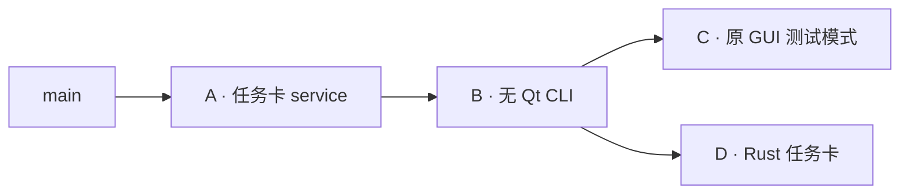

# Rust GUI 渐进迁移计划

2026-09-27；A/B/C 已拆分并逐支验证，Rust 已接入 B 的协议。后续功能仍按下表推进。

近期目标：Rust 接管界面，助手业务保留 Python CLI。每一步都能独立验收，
原 GUI 在替代能力完整前继续可用。配置类初始化重构不纳入本轮，保留已有 TODO。

## 当前状态

| 代号 | PR / 分支 | 基线 | 范围 |
| --- | --- | --- | --- |
| A | [#97](https://github.com/LevelDownRefine/OneDragon-Helper/pull/97)，`codex/rust-feasibility@87e4dda` | `main@eaeceb2` | 任务卡 service，4 个文件 |
| B | [#101](https://github.com/LevelDownRefine/OneDragon-Helper/pull/101)，`codex/headless-cli@9937dd1` | A | 无 Qt CLI，6 个文件 |
| C | [#102](https://github.com/LevelDownRefine/OneDragon-Helper/pull/102)，`codex/qt-cli-task-card@04bd819` | B | 原 GUI 测试模式，16 个文件 |
| D | `codex/rust-gui-prototype` | B | Rust 窗口与任务卡；不包含 C 的 Qt 接入 |

拆分保留 #97 后续清理后的实现：日常响应为 `name/task/sequence/enabled/options`，
周常为 `name/task/options/start_day`；Rust 已适配，请求参数 `daily_name/weekly_name` 不变。
临时配置同步复制 main 的 `script_resources.yml`，不复制真实用户配置。

原始引用保留在远端 `codex/pr97-before-split-20260927@a79c4b2` 和
`codex/rust-gui-before-split-20260927@f1c0572`。旧 #97 评审留在原 PR：service 讨论仍归
#97，CLI 及进程契约转 #101，Qt 控制器/菜单/测试转 #102；测量材料已在拆分前移除。

验证：A/B/C/D 分别通过 Ubuntu 全量 1111/1124/1133/1125 项，均有原有的 34 项跳过。
A 的 9 项 service、B 的 13 项 CLI、C 的 14 项 GUI/launcher 测试另行独立通过；
D 的 12 项 Rust 测试、真实 CLI 与 Windows 窗口截图验证通过。Ruff、rustfmt、严格 Clippy 通过。

## #97 的拆分边界

A/B/C 按最终代码拆分，未按原提交直接分组；保留了 `f6a78fd`、`a79c4b2` 的去重、校验顺序和锁测试修正。

| PR | 独立目的 | 主要文件 | 完成标准 |
| --- | --- | --- | --- |
| A：任务卡 service | 给调用方提供统一查询与编辑，不涉及进程或 GUI | `src/service/task_service.py`、`app_service.py` 的六个薄接口、`tests/service/test_task_service.py` | 直接调用 service 可读写日常/周常；拒绝非法选择并保留原选择；整数/布尔、周常 0、写后反读语义正确；不导入 Qt |
| B：无 Qt CLI | 将 A 暴露为可供任何前端调用的进程接口 | `src/headless.py`、`tests/test_headless.py`、`tests/support/headless.py` | `call` 和 `serve --stdio` 可独立运行；真实临时配置往返；UTF-8、错误响应、部分写入、EOF 释放运行锁；不依赖 GUI |
| C：原 GUI 接入 | 用原窗口验证同一套 CLI，作为可选测试模式 | `src/gui/cli_client.py`、`controllers/cli_task_card.py`、`task_card.py`、`game_list.py`、`main_window.py`、QML，以及 `src/cli.py`、`launcher.py` 的 `--cli-backend` 路由 | 默认 GUI 行为不变；CLI 模式异步读写任务卡；不绕过 CLI 读写；断线可刷新、不重放写入；本地与 CLI 展示一致；未接入入口禁用 |

测试随所属行为拆分：

- A 将现有协议测试中关于选择合法性、类型和写入结果的核心断言补到 service 层，
  不能只带当前两个 service 测试就称为完整验收。
- B 保留真实子进程与适配器集成测试；这些测试保证 A 经协议暴露后仍有同样行为。
- C 带 `tests/gui/test_cli_backend.py`、`tests/support/cli_gui_scene.py`、
  `tests/test_launcher.py` 和倒计时测试中的相应调整；QProcess 生命周期与界面接线一并审查。
- `src/utils/utils_config.py` 的两行 TODO 可随 C 保留，只有注释，不修改 `ScriptConfig`。
  现有读取可能触发模板对齐，不把此次拆分描述为消除了查询的全部写盘副作用。
- service 文档随 A；协议说明随 B；现有 GUI 测试模式说明随 C。历史测量材料已从最新
  #97 清理，拆分不得重新引入；总体路线仅保留一个文档入口。

依赖与合并关系：

C 是验证前端，不是 Rust 的运行依赖。D 可以在 B 稳定后接入，不能继续从包含全部
Qt GUI 接入改动的旧分支堆叠，也不需要复制一套 Python 后端。

合并顺序：A 合入后把 B 转到 main；B 合入后 C、D 分别转到 main。此时重新核对
差异与 CI，避免父 PR 被 squash 后重复带入旧提交。各 PR 保留完整测试覆盖。

## Rust 原型 D 的范围

1. 基于 B 的最终版本，仅迁入现有两个 Rust 实现提交中的前端、资源和开发工具改动。
   当前提交也改过评估文档和 CI，需按内容选择，不能直接整段复制旧文档。
2. 修改 `rust-gui/src/model.rs`、展示层及测试，消费最新任务卡响应；不加双结构兼容层。
3. 范围固定为现有窗口布局、脚本切换、日常/周常读写、连接状态与错误处理。
   启动、设置、壁纸切换等保持“暂不可用”。
4. 保留真实 CLI 集成测试、菜单交互测试与窗口截图验证；D 的 CI 只增加 Rust 所需检查。

D 的验收是独立 Rust 程序完成“切换脚本 → 改任务 → 反读 → 切回确认”，
并验证崩溃/超时不重放写操作、退出回收所属 CLI；Python 子进程不能导入 Qt/GUI。
原 Qt GUI 文件继续服务原版，不因 Rust 已有对应界面就立即从仓库删除。

`run_rust_gui.py`、`export_rust_icons.py` 及两份测试文件留在 D，属于开发辅助。
正常 Rust 前端调用已配置的 Python CLI，不需要经 Python 启动器或 Qt 图标导出器运行。
把开发工具改成 Rust 不作为此阶段目标，也不计入移除业务 Python 的进展。

## 后续按用户操作逐项推进

每行都是后续的独立增量，不合成一个“补齐所有功能”的 PR。需要新 CLI 接口时，
先交付后端接口与测试，再由 Rust 接入；已有接口够用时只修改前端。
下面的接口名称是候选设计，当前尚未实现。

| 顺序 | 增量 | Python / Rust 边界 | 验收重点 |
| --- | --- | --- | --- |
| E | 打开主页、目录、日志、配置文件 | Python 返回已解析目标与不可用原因；Rust 调系统浏览器/文件管理器 | 目标正确，缺失路径可解释；不在 Rust 重写脚本路径规则 |
| F | 单脚本配置弹窗 | `script.edit_data/update` 复用现有 service；Rust 负责表单草稿与错误展示 | 保存反读、取消不写、原生任务开关和超时保真；不改配置类初始化 |
| G | 脚本增删、排序、勾选 | `script.add/remove/reorder` 负责校验与保存；Rust 管交互状态 | 重复/失效路径处理、顺序和既有勾选语义一致；外部拖入可另做后续 PR |
| H | 手动运行当前/全部 | Python 校验并启动既有独立调度/Runner；Rust 确认与显示结果 | 不在串行 stdio 会话内等待整条脚本链；GUI 退出不结束已启动的运行；取消保留既有语义 |
| I | 启动与运行设置 | Python 读写设置和凭据；Rust 展示表单 | 取消不写、授权码不回显/不进入参数或日志；启动倒计时与手动运行分别验证 |
| J | 每日计划 | Python 保留 Windows 任务注册与状态反读；Rust 提供编辑界面 | 注册/暂停/回读一致；系统任务指向无 GUI 入口，关闭窗口后仍可触发 |
| K | 备份与恢复 | 复用 Python 备份业务；Rust 选文件并显示结果 | 保留本机游戏路径、部分成功反馈；使用临时配置回归 |
| L | 图标、拖放、壁纸 | Rust 提取图标、收集拖入路径、渲染图片/视频；Python 解析业务路径与保存映射 | 先静态资源，再原生拖放，最后视频，各自提交；缩放、管理员拖入、缺失资源降级 |
| M | 更新界面与退出交接 | Python 保留检查/下载/校验/安装事务；Rust 管进度与确认 | 先定义后台任务和取消协议；再接 UI；GUI/Backend 会话身份、运行锁、全部退出后替换及重启单独验证 |

H 的启动游戏动作单独验证路径与启动策略，不用“打开目录”的接口隐式执行程序。
运行后的关机确认仍有 Qt 耦合：启用 Rust 侧的关机选项前，需要单独交付 Rust 确认窗
及 Python 调用契约；未完成时明确禁用该选项。不能悄悄拉起 PySide6 弹窗。
Runner 是独立 submodule；确需修改时到其仓库单独提交，主仓只更新指针。

## 发布与评估的关口

- D 完成后先做受限功能的打包试验：Rust EXE + 无 Qt Python CLI 目录式后端，
  明确支持的任务卡功能。分别记录前端、后端和所需其他组件的大小，不当作完整替代包。
- 在同一机器、配置和功能范围下测进程创建到首帧、任务卡可操作的时间与多次分布；
  冷启动和预热启动分开，不能只拿空窗口或单个 EXE 宣称整包收益。
- 完整替代发布前，验收上述用户操作、关机确认、计划和更新；再从新发行包中移除
  Python GUI / Qt 依赖。源码删除与旧入口下线另开 PR，不和首次替代发布捆绑。
- 是否继续迁移 service/config/log/update 到 Rust，等完整包体积和启动瓶颈确定后再决定。
  近期不更换配置格式、不重复实现同一份业务，也不迁移外部脚本内部算法。

每个代码 PR 按 `TESTING.md` 跑 Ubuntu 全量测试和 Ruff；涉及 Rust 时增加
rustfmt、严格 Clippy 和实际 Python CLI 集成测试。Windows 验证按现有平台分工执行，
窗口截图用于布局检查，不替代交互测试；发布产物另跑 Windows EXE 集成测试。

下一步按 A → B 审查与合并，再分别评审 C / D；新增功能从 E 开始另开 PR。
